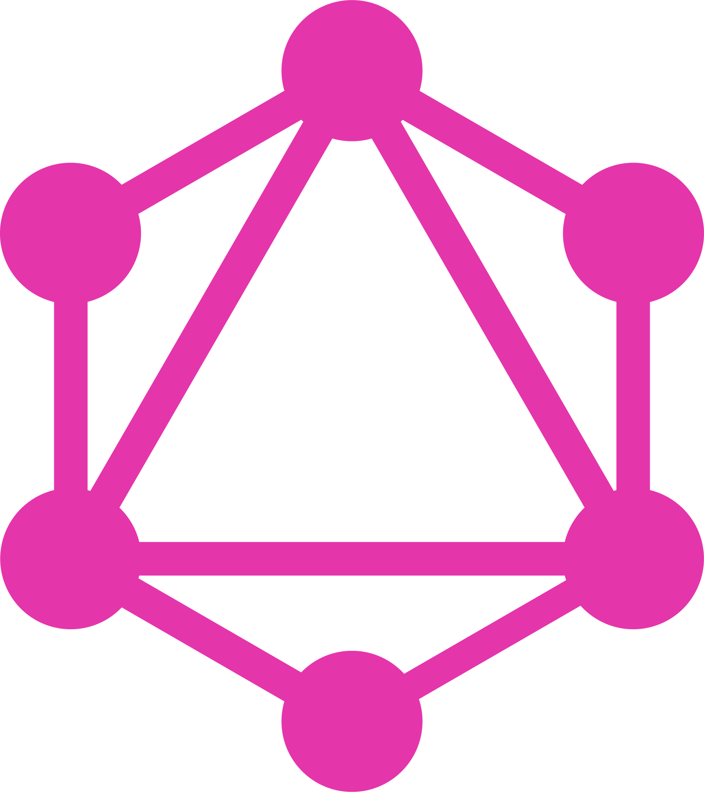

<link href="/styles/style.css" rel="stylesheet"></link>

### Hi! My name is [Alex][website]!

## I'm a Full Stack Developer👨🏻‍💻 Instructor👨🏻‍🏫 Musician👨🏻‍🎤 and Dog Dad🐕

- 🚧 Right now I'm working on a small [Expense Tracker](https://github.com/helloalexdodd/full-stack-expense-tracker) app.
- 🌱 I’m currently learning [Ruby and Ruby on Rails](https://github.com/helloalexdodd/hello-alex-blog) 💎
- 👨🏻‍💼 I am employed at [BIMM](https://bimm.com/) working on the [Audi](https://www.audi.ca/ca/web/en/new-cars.html) Team
- 🥅 2021 Goals: Contribute more to Open Source projects
- ⚡ Loves include Vue.js, , Fruit based desserts,

 

### Connect with me:

[][website]
[][linkedin]
[][twitter]

 
 

## Languages and Tools:

 
 

## Github Stats:

  

    
    
  

[website]: https://alexdodd.ca
[linkedin]: https://linkedin.com/in/helloalexdodd
[twitter]: https://twitter.com/helloalexdodd
